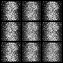
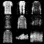
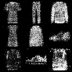
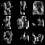
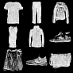
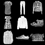
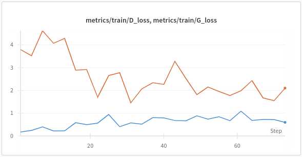
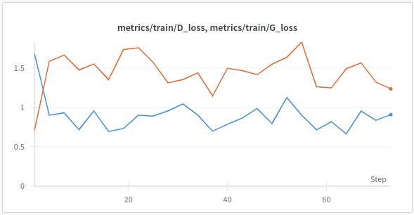

# fashion-mnist-cgan
## Architectures
* Conditional Generative Adversarial Nets [(2014)](https://arxiv.org/abs/1411.1784)
* Deep Convolutional Generative Adversarial Networks [(2016)](https://arxiv.org/abs/1511.06434#)

### Results
Interactive report: [link](https://wandb.ai/zuzg-research/fashion-mnist/reports/Fashion-MNIST--Vmlldzo5MDI4NzE4?accessToken=k5q5wfjp8rxaqk9gcmq3o6vtlfmjatz1o90bf5nshsz6f345f9hcswhtqxit37ki)
#### Generator output progress

| Model  | Epoch 0 | Epoch 12 | Epoch 24 |
| ------------- | ------------- | ------------- | ------------- |
| CGAN  |  |  | |
| DCGAN  |  |  | |

#### Loss
| Model  | BCE Loss | 
| ------------- | ------------- | 
| CGAN  |  | 
| DCGAN  |  | 

## Running
1. Build the container.
```sh
docker build -t fashion .
```
2. Run.
```sh
docker run --runtime=nvidia fashion
```

If you want to use Weights & Biases make sure to assign your key to `WANDB_API_KEY` env variable and run:
```sh
docker run --runtime=nvidia --env-file .env fashion --wandb 1

```
## Further improvements
* Pretraining generator model
* Testing other architectures
* More extensive hyperparameter tuning
* Writing tests
